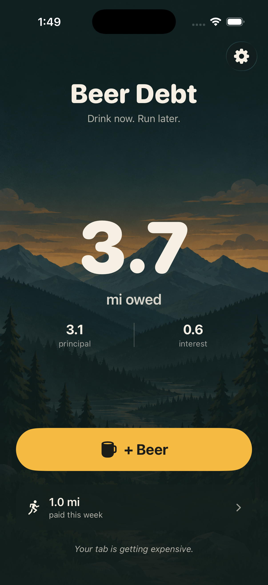
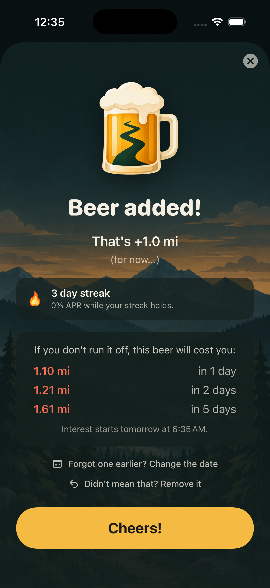
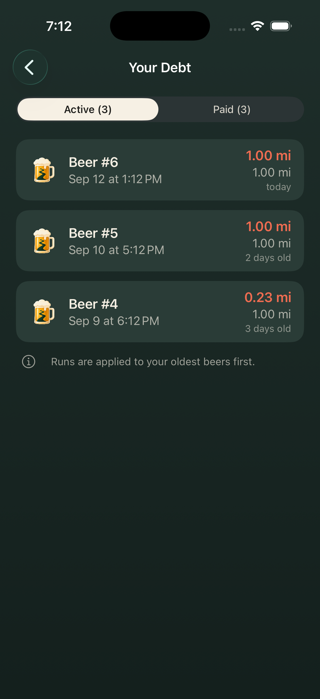
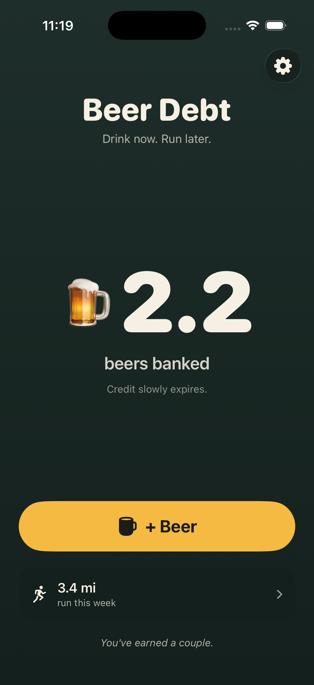

# Beer Debt

**Drink now. Run later.**

A deliberately simple iPhone app that treats beer like a loan you pay back in miles.
Drink beer → owe miles. Run miles → pay for beer. Ignore the debt → it grows.
Bank too much credit → it fades.

It is a ridiculously serious financial app for an unserious liability: personal
finance app × running app × neighborhood bar. Not a fitness tracker, not a sobriety
app, not a health dashboard.

- [`docs/spec.md`](docs/spec.md) — the product spec and MVP acceptance criteria (source of truth for *what*)
- [`docs/decisions.md`](docs/decisions.md) — review notes on the spec vs. concept art, and the accounting/platform decisions (source of truth for *how*)
- [`docs/concept.png`](docs/concept.png) — concept art for the eight screens
- [`docs/art/`](docs/art/) — the shipped art: app icon, backdrop, trophy
- [`index.html`](index.html), [`support.html`](support.html), [`privacy.html`](privacy.html) — the GitHub Pages site (watsoncolin.github.io/beer-debt-ios)

<p>




</p>

## The loop

1. Tap **+ Beer**. Balance becomes 1 mi of debt.
2. Time passes. After the grace period, interest starts.
3. Go for a run. Apple Health hands the workout to the app.
4. The run pays the oldest beer first. Leftover miles become beer credit, up to a cap.
5. Credit slowly expires. Beers spend credit before creating new debt.

Everything is computed by replaying an event ledger (beers + runs) with the rules in
force at the time. No background jobs; killing and reopening the app produces
exactly the same balance.

## Stack

- SwiftUI, iOS 17+, Swift 6 language mode, **no third-party dependencies**
- HealthKit, read-only: running workouts only, with background delivery so a run pays the tab while the app is closed
- Local notifications when a run lands, and an optional weekly recap; no push server
- Home Screen and Lock Screen widgets, fed by the same engine through an App Group
- Local-first: one JSON ledger file in Application Support. No accounts, no backend.
- `BalanceEngine` is a pure function of `(beers, runs, rules, now)` and is the
  cross-platform contract — the Android port reuses the spec and the engine's test
  fixtures.

## Build

Requires Xcode 26+. The project is generated from `project.yml` with
[XcodeGen](https://github.com/yonaskolb/XcodeGen):

```sh
brew install xcodegen     # if needed
xcodegen generate         # regenerate BeerDebt.xcodeproj from project.yml
open BeerDebt.xcodeproj
```

Run the `BeerDebt` scheme. HealthKit works in the simulator (add workouts in the
Health app), but the real test is a run on your wrist.

```sh
xcodebuild -project BeerDebt.xcodeproj -scheme BeerDebt \
  -destination 'platform=iOS Simulator,name=iPhone 16 Pro' test
```

## Release

Xcode Cloud archives every push to `main` and delivers it to TestFlight.
See [`docs/release.md`](docs/release.md).

## Layout

| Folder | What lives there |
|---|---|
| `BeerDebt/Engine/` | `BalanceEngine` + `Balance` — pure accounting, no I/O |
| `BeerDebt/Models/` | `BeerEntry`, `RunEntry`, `Rules` — immutable events + snapshotted rules |
| `BeerDebt/Persistence/` | `LedgerStore` — the observable owner of the ledger file |
| `BeerDebt/Health/` | `HealthKitService` — read running workouts, dedup by workout UUID |
| `BeerDebt/Features/` | Home, The Ledger, Settings, Health onboarding |
| `BeerDebt/Theme/` | Palette: beer gold, forest green, cream |
| `BeerDebtTests/` | Engine tests with fixed instants |

## Status

MVP loop implemented: + Beer → debt → daily interest → HealthKit run →
FIFO repayment → credit (capped, decaying) → debt-free celebration. Home,
The Ledger (beers and runs), Settings (forward-only rules changes), and Health
onboarding are in. A forgotten beer can be dated back, and an accidental one
deleted, from either sheet. 49 engine and store tests pass.

Ships to TestFlight via Xcode Cloud. Not yet: on-device HealthKit test,
JSON engine fixtures for the Android port.
